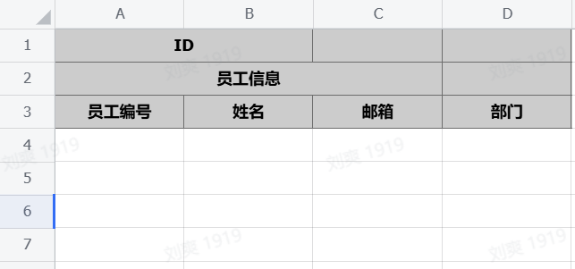

# feishu-table-helper

飞书表格助手，根据实体类注解映射创建、读取、写入飞书表格。

## 项目简介

feishu-table-helper 是一个简化飞书表格操作的 Java 库。通过使用注解，开发者可以轻松地将 Java 实体类映射到飞书表格，实现表格的自动创建、数据读取和写入操作，大大简化了与飞书表格 API 的交互。

## 功能特性

- **注解驱动**: 使用 [@TableProperty](file://../src/main/java/cn/isliu/core/annotation/TableProperty.java#L15-L71) 注解将实体类字段映射到表格列
- **自动创建表格**: 根据实体类结构自动创建飞书表格和设置表头
- **数据读取**: 从飞书表格读取数据并映射到实体类对象
- **数据写入**: 将实体类对象写入飞书表格，支持新增和更新操作
- **灵活配置**: 支持自定义表格样式、单元格格式等

## 安装

### Maven

```xml
<dependency>
    <groupId>cn.isliu</groupId>
    <artifactId>feishu-table-helper</artifactId>
    <version>0.0.6</version>
</dependency>
```

### Gradle

```gradle
implementation 'cn.isliu:feishu-table-helper:0.0.6'
```

## 快速开始

### 1. 配置飞书应用凭证

```java
// 初始化配置
try (FsClient fsClient = FsClient.getInstance()) {
    fsClient.initializeClient("your_app_id","your_app_secret");
    
    // TODO 读写数据
}
```

### 2. 创建实体类

```java
@TableConf(headLine = 4, titleRow = 3, enableDesc = true)
public class Employee extends BaseEntity {

    @TableProperty(value = {"ID", "员工信息", "员工编号"}, order = 0, desc = "员工编号不超过20个字符")
    private String employeeId;

    @TableProperty(value = {"ID", "员工信息", "姓名"}, order = 1, desc = "员工姓名不超过20个字符")
    private String name;

    @TableProperty(value = "部门", order = 3, desc = "员工部门不超过20个字符")
    private String department;

    @TableProperty(value = {"员工信息", "邮箱"}, order = 2, desc = "员工邮箱不超过50个字符")
    private String email;

    // getters and setters...
}
```

### 3. 创建表格

```java
// 根据实体类创建表格
String sheetId = FsHelper.create("员工表", "your_spreadsheet_token", Employee.class);
```



### 4. 写入数据

```java
List<Employee> employees = new ArrayList<>();
Employee emp = new Employee();
emp.name = "张三";
emp.email = "zhangsan@company.com";
emp.department = "技术部";
employees.add(emp);

FsHelper.write("your_sheet_id", "your_spreadsheet_token", employees);
```

### 5. 读取数据

```java
List<Employee> employees = FsHelper.read("your_sheet_id", "your_spreadsheet_token", Employee.class);
employees.forEach(emp -> System.out.println(emp.name + " - " + emp.email));
```

## 核心注解

### @TableProperty

用于将实体类字段映射到表格列：

- `value()`: 表格列名
- `order()`: 字段排序顺序
- `type()`: 字段类型（文本、单选、多选等）
- `enumClass()`: 枚举类（用于单选/多选类型）
- `fieldFormatClass()`: 字段格式化处理类
- `optionsClass()`: 选项处理类

### @TableConf

用于配置表格样式：

- `uniKeys()`: 唯一键索引，用于数据更新
- `headLine()`: 表头行数
- `titleLine()`: 标题行数
- `enableCover()`: 是否开启覆盖写入
- `isText()`: 是否设置表格为纯文本
- `headFontColor()`: 表头字体颜色
- `headBackColor()`: 表头背景颜色
- `enableDesc()`: 是否开启字段描述
- `upsert()`: 是否启用 Upsert 模式

## 依赖

- 飞书开放平台 SDK (oapi-sdk) v2.4.21
- OkHttp v4.12.0
- Gson v2.8.9

## 许可证

本项目采用 Apache License 2.0 许可证。详情请见 [LICENSE](LICENSE) 文件。